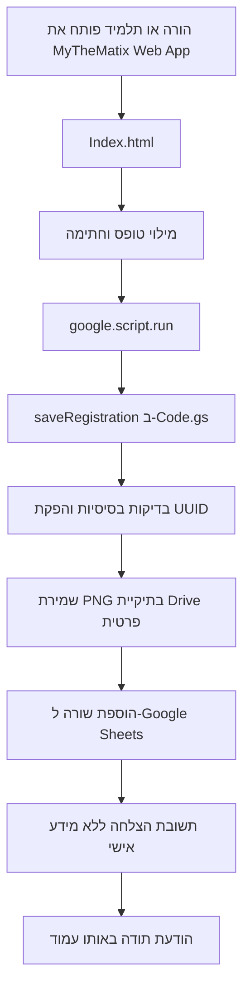

# MyTheMatix — אפיון ותוכנית פעולה לטופס הרשמה

## 1. סטטוס המסמך

- סוג התוצר: אפיון ותוכנית מימוש בלבד.
- שלב: MVP — גרסה ראשונה פעילה.
- פלטפורמה: Google Apps Script Web App.
- ממשק משתמש: `Index.html` מותאם לעברית ול־RTL.
- שמירת נתונים: Google Sheets.
- שמירת חתימות: תיקייה פרטית ב־Google Drive.
- מיתוג: MyTheMatix.
- תאריך האפיון: 5 באוגוסט 2026.

## 2. מטרת הפרויקט

לבנות עבור MyTheMatix עמוד הרשמה עצמאי, מקצועי ורספונסיבי, בהשראת המבנה הפונקציונלי של עמוד ההרשמה שנבדק אך בעיצוב מקורי לחלוטין.

העמוד יציג מידע על התוכנית, תנאי תשלום ותקנון, יאסוף את פרטי התלמיד וההורה, יחייב חתימת הורה וישמור הרשמה חדשה ב־Google Sheets. לאחר שמירה מוצלחת תוצג הודעת תודה באותו עמוד.

## 3. החלטות שאושרו

1. אין להשתמש בלוגו, בתמונת הרקע או בנכסים החזותיים של אתר המקור.
2. שם המותג יהיה **MyTheMatix**.
3. העיצוב יהיה מקורי, חדשני, מקצועי ופשוט יחסית.
4. מותר לטעון פונטים ואייקונים ממקורות אינטרנטיים באמצעות HTTPS.
5. מחיר המנוי החודשי יהיה **650 ₪**.
6. תקופת התוכנית תישאר **1.9.26–30.6.27**.
7. הסעיף העוסק בכיתת תרגול נוספת יוסר.
8. כל שדות התלמיד וההורה הקיימים יישמרו.
9. חתימת ההורה תהיה שדה חובה.
10. לא תיכלל אפשרות לשליפת נרשם חוזר לפי תעודת זהות.
11. לא תישלח התראה בדוא״ל לאחר הרשמה.
12. לאחר שמירה תוצג הודעת תודה בתוך העמוד, ללא מעבר לעמוד אחר.
13. פרטי ההתקשרות—כתובת, טלפון ודוא״ל—מולאו בערכים סופיים; סעיף Instagram הוסר מהיקף ה־MVP.
14. מסך ניהול ייעודי יוגדר כפיצ׳ר עתידי.
15. בדיקות ישראליות מלאות לתעודת זהות ולטלפון יוגדרו כפיצ׳רים עתידיים.
16. ה־MVP יפורסם תחת כתובת Google Apps Script ולא בדומיין עצמאי.

## 4. גבולות השימוש באתר המקור

אתר המקור ישמש להבנת סוגי התוכן, מבנה הטופס והזרימה בלבד.

- אין להעתיק ממנו לוגו, רקע, תמונות, קוד או שפה עיצובית.
- אין ליצור העתק חזותי של העמוד.
- תוכן תיאורי ותקנוני ינוסח מחדש באופן עצמאי תוך שמירה על העובדות שאושרו.
- לפני פרסום אמיתי יש לוודא של־MyTheMatix יש זכות להשתמש בכל נוסח סופי, בשם המותג ובכל נכס שיוכנס בעתיד.

## 5. היקף ה־MVP

### בתוך ההיקף

- עמוד HTML יחיד לממשק המשתמש בתוך פרויקט Apps Script.
- עיצוב RTL רספונסיבי למחשב, טאבלט ומובייל.
- אזור פתיחה ממותג.
- הצגת מרכיבי התוכנית.
- הצגת פרטי התשלום.
- הצגת התקנון.
- טופס תלמיד והורה.
- משטח חתימה מותאם לעכבר ולמגע.
- שמירת נתונים ב־Google Sheets.
- שמירת חתימה כקובץ PNG פרטי ב־Google Drive.
- מצב טעינה, הודעת הצלחה והודעת שגיאה.
- מניעת שליחה כפולה בסיסית.
- מבנה נתונים המותאם להגירה עתידית.

### מחוץ להיקף

- דומיין מותאם אישית.
- מסך ניהול ייעודי.
- כניסת מנהל או מערכת הרשאות למנהלים.
- עריכה או מחיקה של הרשמה דרך האתר.
- שליפת נרשמים קודמים.
- שליחת הודעות דוא״ל, SMS או WhatsApp.
- סליקה או הוראת קבע.
- בדיקת תעודת זהות ישראלית מלאה.
- זיהוי כפילויות מתקדם לפי תעודת זהות, טלפון או דוא״ל.
- API ציבורי כללי.

## 6. ארכיטקטורה



### רכיבי המערכת

1. `Index.html`
   - HTML סמנטי, CSS ו־JavaScript של הממשק.
   - כולל את כל התוכן והעיצוב של העמוד.
   - קורא לפונקציות השרת באמצעות `google.script.run`.

2. `Code.gs`
   - מגיש את `Index.html` באמצעות `doGet()`.
   - מקבל ושומר הרשמות באמצעות `saveRegistration(payload)`.
   - שומר חתימות ב־Drive ומוסיף שורות ל־Sheets.

3. Google Sheet פרטי
   - מקור הנתונים המרכזי של גרסת ה־MVP.
   - משמש גם כממשק צפייה תפעולי זמני.

4. תיקיית Google Drive פרטית
   - מכילה קובץ PNG אחד לכל הרשמה.
   - אינה משותפת לציבור ואינה מחזירה קישור ציבורי לנרשם.

5. Script Properties
   - שמירת `SPREADSHEET_ID`, ‏`SHEET_NAME` ו־`SIGNATURE_FOLDER_ID` מחוץ לקוד הממשק.

## 7. קבצים ותוצרים בשלב המימוש

```text
MyTheMatix Registration/
├── appsscript.json
├── Code.gs
└── Index.html
```

- `Index.html` יכיל את העיצוב, הטופס והלוגיקה בצד הלקוח.
- `Code.gs` יכיל רק לוגיקת שרת.
- `appsscript.json` יגדיר אזור זמן והרשאות נדרשות בלבד.
- הגיליון ותיקיית החתימות ייווצרו בנפרד בחשבון Google שבבעלות העסק.

## 8. אפיון התוכן

### 8.1 אזור פתיחה

- לוגו טקסטואלי/גאומטרי מקורי: `MyTheMatix`.
- כותרת: תוכנית מתמטיקה — שנת הלימודים 26–27.
- משפט קצר המציג סביבת למידה תומכת וממוקדת הצלחה.
- קישור גלילה ברור לאזור ההרשמה.

### 8.2 מרכיבי התוכנית

התוכן ינוסח מחדש ויכלול את הנושאים הבאים:

- שיעור שבועי קבוע בן 50 דקות המשלב הסבר ותרגול.
- תיעוד השיעורים לצורך חזרה על החומר.
- תמיכה נקודתית בזמן תרגול שיעורי הבית.
- מרתוני תרגול ממוקדים לפני בחינות.
- שעת קבלה שבועית לתמיכה בשיעורי הבית.

לא ייכלל סעיף על כיתת תרגול נוספת.

### 8.3 פרטי תשלום

- תקופת התוכנית: 1.9.26–30.6.27.
- דמי מנוי חודשיים: 650 ₪.
- אופן התשלום והיום בחודש יוצגו בהתאם לנוסח הסופי שיאושר לפני הפרסום.
- אין לבצע גבייה דרך הטופס בגרסה זו.

### 8.4 תקנון

התקנון יוצג במבנה קריא, ממוספר ונגיש. במובייל ניתן להשתמש ב־`details/summary` או באזור מתקפל, כל עוד מלוא התקנון נגיש לפני החתימה.

הנושאים שיש לשמר בנוסח עצמאי:

- הגעה בזמן וציוד נדרש.
- השתקת טלפונים במהלך השיעור.
- חישוב המנוי לפי ממוצע של ארבעה שיעורים בחודש.
- מדיניות היעדרויות והשלמות.
- הודעה מוקדמת במקרה של ביטול.
- חגים, מועדים והשלמת שיעורים.
- מעבר ללמידה מרחוק במקרה של מצב חירום.

### 8.5 פרטי התקשרות

יוצג אזור עם אייקונים ופרטי ההתקשרות בפועל:

- כתובת: `הרי יהודה 54`
- טלפון: `052-454-9680`
- דוא״ל: `ohadmath12@gmail.com`

אין סעיף Instagram — הוסר מהיקף ה־MVP.

כל הערכים מרוכזים באובייקט הגדרות אחד בראש קוד הלקוח כדי שניתן יהיה להחליפם ללא חיפוש בכל הקובץ.

## 9. אפיון חזותי

### 9.1 כיוון עיצובי

הכיוון יהיה “מתמטיקה מודרנית ואנושית”: רקע כהה ומעודן, צורות גאומטריות מקוריות המופקות ב־CSS, כרטיסי תוכן בהירים או שקופים למחצה, והדגשות צבע מדודות.

אין להשתמש בתמונת הרקע של אתר המקור. אין צורך בתמונת רקע חיצונית.

### 9.2 פלטת צבעים מוצעת

- רקע ראשי: `#0B1020`.
- משטח משני: `#141B34`.
- צבע מותג: `#6366F1`.
- הדגשה משנית: `#22D3EE`.
- הצלחה: `#16A34A`.
- שגיאה: `#DC2626`.
- טקסט ראשי: `#F8FAFC`.
- טקסט משני: `#CBD5E1`.
- שדות בהירים: `#FFFFFF` עם טקסט `#111827`.

הצבעים הסופיים ייבדקו לניגודיות מספקת ולא יישענו על צבע בלבד להעברת מצב.

### 9.3 טיפוגרפיה ואייקונים

- פונט עברי מוצע: `Heebo` או `Assistant` מ־Google Fonts.
- משפחת fallback מערכתית תוגדר למקרה שהפונט החיצוני אינו נטען.
- אייקונים ייטענו מספרייה אחת בלבד, למשל Font Awesome או Lucide.
- אין לערבב כמה ספריות אייקונים.

### 9.4 פריסה

- מובייל: עמודה אחת, ריווח נדיב וכפתור שליחה ברוחב מלא.
- מחשב: אזורי התוכן והטופס יוצגו בפריסה מאוזנת; רוחב התוכן המרבי יהיה כ־1,180px.
- טופס: כרטיס מרכזי עם קבוצות שדות ברורות.
- שדות קשורים יוצגו בשתי עמודות במחשב ובעמודה אחת במובייל.
- אזור החתימה יהיה ברוחב מלא וללא גלילה אופקית.

### 9.5 אנימציה

- אנימציות קצרות ועדינות בלבד.
- יש לכבד `prefers-reduced-motion`.
- אין להשתמש באנימציות רקע כבדות או באפקטים הפוגעים בקריאות.

## 10. אפיון הטופס

| קבוצה | תווית | מפתח פנימי | סוג | אפשרויות | חובה |
|---|---|---|---|---|---|
| תלמיד | שם פרטי | `student_first_name` | טקסט | — | כן |
| תלמיד | שם משפחה | `student_last_name` | טקסט | — | כן |
| תלמיד | תעודת זהות | `student_id` | טקסט | — | כן |
| תלמיד | טלפון נייד | `student_phone` | טלפון/טקסט | — | כן |
| תלמיד | כתובת דוא״ל | `student_email` | דוא״ל | — | לא |
| לימודים | שם בית הספר | `school_name` | רשימה | חטיבת הביניים הראשונים גני תקווה, חטיבת בראשית גני תקווה, תיכון מיתר גני תקווה, חטיבת בן צבי קריית אונו, תיכון בן צבי קריית אונו, חטיבת שמעון פרס קריית אונו, חטיבת שז״ר קריית אונו | כן |
| לימודים | כיתה | `class_name` | רשימה | ז, ח, ט, י, י״א, י״ב | כן |
| לימודים | כיתה מדעית | `is_science` | רדיו | כן, לא | כן |
| לימודים | הקבצה / מספר יח״ל | `units` | רשימה | לא רלוונטי, הקבצה א, הקבצה א׳ חדשה, הקבצה ב, 4 יח״ל, 5 יח״ל | כן |
| הורה | מבצע ההרשמה | `parent_role` | רשימה | אב, אם | כן |
| הורה | שם ההורה | `parent_name` | טקסט | — | כן |
| הורה | כתובת דוא״ל ההורה | `parent_email` | דוא״ל | — | כן |
| אישור | חתימת ההורה | `signature_data_url` | Canvas/PNG | — | כן |

### התנהגות הטופס

- לכל שדה תהיה תווית גלויה המקושרת אליו.
- שדות חובה יסומנו בטקסט ובמאפיין `required`.
- לא יופיע טקסט המתייחס לנרשמים חוזרים.
- לא תתבצע פנייה לשרת בזמן הזנת תעודת הזהות.
- לחתימה יהיה כפתור “נקה חתימה”.
- כפתור השליחה יהיה מושבת בזמן השמירה.
- ניסיון לשלוח ללא חתימה יציג שגיאה נגישה ליד אזור החתימה.
- לאחר הצלחה יוצג מסך/כרטיס תודה בתוך אותו עמוד.
- לאחר הצלחה לא תבוצע הפניה אוטומטית ולא יוצגו מחדש הנתונים שהוזנו.
- במקרה כשל, הנתונים יישארו בטופס כדי לאלץ את המשתמש להזין אותם מחדש כמה שפחות.

## 11. משטח החתימה

- ימומש באמצעות Canvas ויתמוך בעכבר, עט ומגע.
- ממדי ה־Canvas יותאמו ל־`devicePixelRatio` כדי למנוע חתימה מטושטשת.
- החתימה תיוצא כ־PNG בלבד.
- לפני השליחה תיבדק נוכחות של קו חתימה בפועל ולא רק קיומו של Canvas.
- יוגדר גודל מרבי סביר ל־Data URL לפני העברה לשרת.
- בצד השרת תאומת כותרת `data:image/png;base64,` והנתונים יפוענחו ל־Blob.
- שם הקובץ יהיה מזהה ההרשמה, לדוגמה: `5f8...c2.png`.
- קובץ החתימה יישאר פרטי ב־Drive.

## 12. מבנה Google Sheets

שם הגיליון המוצע: `Registrations`.

| עמודה | שם טכני | סוג שמירה | הערה להגירה |
|---|---|---|---|
| A | `registration_id` | טקסט UUID | מפתח ראשי עתידי |
| B | `submitted_at` | תאריך ושעה | ISO 8601 / Asia/Jerusalem |
| C | `schema_version` | מספר | מתחיל ב־1 |
| D | `status` | טקסט | `new` ב־MVP |
| E | `student_first_name` | טקסט | — |
| F | `student_last_name` | טקסט | — |
| G | `student_id` | טקסט | לא מספר, כדי לשמור אפסים מובילים |
| H | `student_phone` | טקסט | לא מספר |
| I | `student_email` | טקסט | — |
| J | `school_name` | טקסט | לשמור תווית ולא מזהה מספרי |
| K | `class_name` | טקסט | — |
| L | `is_science` | טקסט | `yes` / `no` |
| M | `units` | טקסט | — |
| N | `parent_role` | טקסט | `father` / `mother` |
| O | `parent_name` | טקסט | — |
| P | `parent_email` | טקסט | — |
| Q | `signature_file_id` | טקסט | מזהה קובץ Drive |
| R | `signature_file_name` | טקסט | שם קבוע לפי UUID |
| S | `source` | טקסט | `google_apps_script_webapp` |

### כללי הגיליון

- שורת כותרת אחת וקבועה.
- אין להשתמש בתאים ממוזגים.
- אין לשנות ידנית שמות עמודות לאחר העלייה לאוויר.
- ערכי מזהים, טלפונים ותעודות זהות יוגדרו כטקסט.
- מסננים ועיצוב מותנה מותרים, אך אינם חלק מהלוגיקה.
- אין לשתף את הגיליון כ־“Anyone with the link”.

## 13. זרימת השמירה

1. המשתמש לוחץ על “שלח הרשמה”.
2. הדפדפן מונע שליחה רגילה ומבצע בדיקות HTML בסיסיות.
3. הקוד מוודא שהחתימה אינה ריקה.
4. נוצר `client_submission_id` זמני למניעת לחיצה כפולה.
5. כפתור השליחה מושבת ומופיע מצב טעינה.
6. `google.script.run` קורא ל־`saveRegistration(payload)`.
7. השרת מבצע בדיקות בסיסיות ומפיק `registration_id` מסוג UUID.
8. `LockService` נועל זמנית את אזור הכתיבה המשותף.
9. החתימה נשמרת כ־PNG בתיקייה הפרטית.
10. שורה חדשה נכתבת לגיליון.
11. הנעילה משתחררת גם במקרה של שגיאה.
12. השרת מחזיר `{ ok: true, registrationId }` ללא מידע אישי.
13. העמוד מציג הודעת תודה ומנקה מידע רגיש מהטופס.

אם שמירת החתימה הצליחה אך כתיבת השורה נכשלה, הקוד ינסה להעביר את קובץ החתימה לאשפה כדי למנוע קבצים יתומים.

## 14. פונקציות Apps Script מתוכננות

```text
doGet()
saveRegistration(payload)
validateRequiredFields_(payload)
normalizePayload_(payload)
decodeSignature_(dataUrl)
saveSignature_(registrationId, blob)
appendRegistration_(record)
buildSuccessResponse_(registrationId)
```

- פונקציות המסתיימות בקו תחתון יהיו פרטיות ולא זמינות לקריאה ישירה מהלקוח.
- אין להעביר ללקוח מזהי Sheet, תיקייה או קובץ חתימה.
- אין לרשום ללוג תעודת זהות, חתימה או payload מלא.

## 15. הרשאות ופריסה

- אפליקציית ה־Web תפורסם כמי שמריצה את הקוד בשם בעל הסקריפט.
- הגישה לעמוד תהיה פתוחה למשתמשים אנונימיים כדי לא לחייב חשבון Google בהרשמה.
- רק חשבון העסק יורשה לגשת לגיליון ולתיקיית החתימות.
- החשבון יוגן באימות דו־שלבי.
- יש להשתמש בחשבון עסקי ייעודי ולא בחשבון אישי משותף בין כמה אנשים.
- יש לשמור תיעוד של בעלות הפרויקט, הגיליון והתיקייה לצורך המשכיות והגירה.

## 16. אבטחה בסיסית הנדרשת ב־MVP

העובדה שהמערכת מיועדת להגירה אינה סיבה לדחות הגנות בסיסיות, משום שהטופס אוסף תעודת זהות וחתימת הורה.

- בדיקת נוכחות של כל השדות בצד השרת.
- הגבלת אורכים סבירה לכל שדה.
- הגבלת גודל החתימה.
- קבלת PNG בלבד.
- המרת ערכים למחרוזות וניקוי תווי בקרה.
- מניעת נוסחאות בגיליון: ערכים המתחילים ב־`=`, ‏`+`, ‏`-` או `@` יישמרו כטקסט בטוח.
- שימוש ב־`LockService` בזמן כתיבה.
- מניעת שליחה כפולה בצד הלקוח.
- שדה honeypot נסתר נגד בוטים פשוטים.
- הודעות שגיאה כלליות ללא פרטי מערכת.
- הרשאות Drive ו־Sheets פרטיות בלבד.
- הימנעות מלוגים המכילים מידע אישי.

CAPTCHA, הגבלת קצב מתקדמת וסינון כפילויות יידחו לשלב עתידי.

## 17. פרטיות ושמירת מידע

- לפני איסוף נתונים אמיתיים יש להציג ליד הכפתור הודעת פרטיות קצרה המסבירה מי אוסף את המידע ולשם מה.
- יש לקבוע מדיניות מחיקה: כמה זמן נשמרים פרטי נרשם שלא הצטרף וכמה זמן נשמרת חתימה.
- יש להגדיר מי בעסק מורשה לצפות בגיליון ובחתימות.
- אין לפרסם קישורים ישירים לקובצי חתימה.
- אין להשתמש במידע לצורך אחר ללא בסיס והרשאה מתאימים.
- נוסח פרטיות ותקנון סופי דורשים בדיקה של בעל העסק ובמידת הצורך ייעוץ משפטי; האפיון אינו ייעוץ משפטי.

## 18. נגישות

- מסמך HTML עם `lang="he"` ו־`dir="rtl"`.
- מבנה כותרות עקבי.
- תוויות מפורשות לכל שדה.
- ניווט מלא באמצעות מקלדת, למעט פעולת השרטוט עצמה שלה יינתן הסבר מתאים.
- טבעת מיקוד גלויה.
- הודעות הצלחה ושגיאה עם `aria-live`.
- אין להסתמך על placeholder כתווית.
- שטחי לחיצה בגודל מתאים למובייל.
- ניגודיות צבעים מספקת.
- תמיכה בהגדלת טקסט ללא גלילה אופקית.

## 19. רספונסיביות ודפדפנים

נקודות בדיקה מינימליות:

- מובייל צר: 360px.
- מובייל נפוץ: 390px.
- טאבלט: 768px.
- מחשב: 1280px.
- מסך רחב: 1440px.

דפדפנים:

- Chrome עדכני במחשב וב־Android.
- Safari עדכני ב־iPhone וב־Mac.
- Edge עדכני.
- Firefox עדכני.

יש לבדוק במיוחד חתימה במגע, כיוון RTL, פתיחת רשימות, שינוי אוריינטציה והופעת המקלדת במובייל.

## 20. מצבי ממשק

### מצב רגיל

- הטופס זמין.
- כפתור השליחה פעיל.

### מצב טעינה

- כפתור השליחה מושבת.
- טקסט הכפתור משתנה ל־“שומר את ההרשמה…”.
- אין לאפשר שליחה נוספת.

### מצב הצלחה

- מוצג כרטיס תודה ברור: “תודה, ההרשמה התקבלה בהצלחה”.
- ניתן להציג מזהה הרשמה שאינו כולל מידע אישי.
- שדות הטופס והחתימה מתנקים.

### מצב שגיאה

- מוצגת הודעה כללית: “לא הצלחנו לשמור את ההרשמה. נסו שוב בעוד מספר רגעים”.
- השדות נשארים מלאים.
- כפתור השליחה חוזר לפעילות.
- אין לחשוף שגיאת Apps Script גולמית.

## 21. בדיקות קבלה

### תוכן ועיצוב

- המותג MyTheMatix מופיע באופן עקבי.
- אין נכסים מאתר המקור.
- המחיר המוצג הוא 650 ₪.
- התאריכים המוצגים הם 1.9.26–30.6.27.
- סעיף כיתת התרגול אינו מופיע.
- פרטי ההתקשרות (כתובת, טלפון, דוא״ל) מוצגים עם הערכים הסופיים; אין סעיף Instagram.

### טופס

- כל השדות המוגדרים באפיון קיימים.
- אין ממשק לנרשם חוזר.
- אי אפשר להשלים שליחה ללא חתימה.
- ניקוי החתימה פועל בעכבר ובמגע.
- כפתור השליחה אינו יוצר שתי הרשמות בלחיצה כפולה.

### שמירה

- כל הרשמה מוצלחת יוצרת שורה אחת בלבד.
- לכל הרשמה נוצר UUID ייחודי.
- קובץ חתימה אחד נוצר בתיקייה הפרטית.
- מזהה קובץ החתימה נשמר בשורה הנכונה.
- תעודת זהות וטלפון נשמרים כטקסט.
- אין קישורי חתימה ציבוריים.

### תגובת ממשק

- הודעת תודה מופיעה רק לאחר שהשרת אישר שמירה.
- כשל בשמירה מציג שגיאה ולא הודעת הצלחה.
- אין מעבר לעמוד תודה אחר.

## 22. תוכנית מימוש

### שלב 1 — הכנת סביבת Google

1. יצירת חשבון עסקי ייעודי או בחירת חשבון בעלים קבוע.
2. יצירת Google Sheet בשם MyTheMatix Registrations.
3. יצירת לשונית `Registrations` והוספת הכותרות המוגדרות.
4. הגדרת עמודות תעודת זהות וטלפון כטקסט.
5. יצירת תיקיית Drive פרטית בשם MyTheMatix Signatures.
6. יצירת פרויקט Apps Script והגדרת Script Properties.

### שלב 2 — בניית הממשק

1. בניית מבנה HTML סמנטי ו־RTL.
2. יצירת מערכת העיצוב המקורית.
3. שילוב התוכן המעודכן.
4. בניית הטופס וכל מצבי הממשק.
5. בניית משטח החתימה הרספונסיבי.

### שלב 3 — בניית השמירה

1. כתיבת `doGet()`.
2. כתיבת `saveRegistration()` והפונקציות הפרטיות.
3. שמירת חתימה ב־Drive.
4. כתיבת שורה ל־Sheets תחת נעילה.
5. טיפול בכשלים ובקבצים יתומים.
6. חיבור Success/Failure handlers לממשק.

### שלב 4 — בדיקות

1. בדיקות שדות חובה.
2. בדיקת חתימה ריקה וחתימה תקינה.
3. בדיקת שליחה כפולה.
4. בדיקת תווים עבריים, גרשיים ואפסים מובילים.
5. בדיקת כשל יזום בגיליון וב־Drive.
6. בדיקות רספונסיביות ודפדפנים.
7. בדיקת הרשאות באמצעות חלון גלישה פרטי.

### שלב 5 — פריסה ומסירה

1. אישור נוסח התוכן, התקנון והפרטיות.
2. מילוי פרטי ההתקשרות.
3. פריסת Web App כגרסת Production.
4. ביצוע הרשמת בדיקה מלאה.
5. אימות שהשורה והחתימה נשמרו באופן פרטי.
6. שמירת תיעוד הגדרות, בעלות ודרך פריסה מחדש.

## 23. הכנה להגירה עתידית

ה־MVP יתוכנן כך שלא יהיה צורך לשנות את הטופס בעת מעבר למסד נתונים אחר.

### עקרונות

- שמות השדות בממשק, ב־Apps Script ובגיליון יהיו זהים.
- לכל רשומה יהיה UUID יציב שאינו תלוי במספר השורה.
- תישמר `schema_version`.
- ערכי בחירה יישמרו כמחרוזות צפויות ולא כטקסט חופשי.
- חתימות ייקראו לפי UUID.
- לא יישמרו נוסחאות עסקיות בתוך הגיליון.
- ממשק המשתמש לא יסתמך על קריאת נתונים מהגיליון.

### תהליך הגירה צפוי

1. עצירת הרשמות לזמן קצר.
2. ייצוא לשונית `Registrations` ל־CSV.
3. הורדת תיקיית החתימות מ־Drive.
4. יצירת טבלה במסד החדש לפי אותו schema.
5. ייבוא CSV.
6. העלאת החתימות לאחסון החדש ועדכון המפתחות.
7. החלפת פונקציית השליחה בלבד או מעבר ל־API חדש.
8. בדיקת ספירות, UUID וקישורי חתימות.
9. פתיחת ההרשמה מחדש.

## 24. פיצ׳רים עתידיים

- מסך ניהול מוגן עם חיפוש, סינון ושינוי סטטוס.
- אימות תעודת זהות ישראלית.
- אימות מספר טלפון ישראלי.
- בדיקות דוא״ל מתקדמות.
- מניעת כפילויות לפי כללים עסקיים.
- CAPTCHA או מנגנון anti-bot מתקדם.
- הגבלת קצב בצד השרת.
- הודעות דוא״ל או WhatsApp.
- ייצוא דוחות ומדדים.
- מדיניות מחיקה אוטומטית.
- גיבוי אוטומטי.
- דומיין מותאם אישית.
- הגירה למסד נתונים ול־API ייעודי.

אפשרות נרשם חוזר אינה חלק מה־MVP ואינה מתוכננת אוטומטית לשלב עתידי; היא תתווסף רק אם תתקבל החלטה חדשה ומודל הרשאות מתאים.

## 25. נתונים שיש להשלים לפני פרסום

- ✅ כתובת העסק, טלפון וכתובת דוא״ל — מולאו (סעיף 8.5).
- נוסח תשלום סופי ואופן התשלום.
- נוסח תקנון סופי ומאושר.
- הודעת פרטיות ותקופת שמירת מידע.
- חשבון Google שיהיה הבעלים הקבוע.
- רשימת מורשי הגישה לגיליון ולחתימות.

## 26. הגדרת סיום

ה־MVP ייחשב מוכן כאשר:

1. העמוד מקורי מבחינה חזותית ואינו משתמש בנכסי אתר המקור.
2. כל התוכן והשינויים שאושרו מופיעים כראוי.
3. הטופס עובד במובייל ובמחשב.
4. חתימה היא חובה ונשמרת כ־PNG פרטי.
5. כל הרשמה יוצרת שורה אחת תקינה ב־Google Sheets.
6. הודעת תודה מוצגת רק לאחר שמירה מוצלחת.
7. הרשאות Sheets ו־Drive נבדקו ואינן ציבוריות.
8. בוצעה הרשמת קצה מלאה בחלון גלישה פרטי.
9. תהליך הפריסה וההגירה תועד.

## 27. מקורות טכניים

- [Google Apps Script Web Apps](https://developers.google.com/apps-script/guides/web)
- [תקשורת בין HTML לפונקציות שרת באמצעות google.script.run](https://developers.google.com/apps-script/guides/html/communication)
- [Google Apps Script Lock Service](https://developers.google.com/apps-script/reference/lock)
- [Google Apps Script Drive Service](https://developers.google.com/apps-script/reference/drive)
- [מכסות Google Apps Script](https://developers.google.com/apps-script/guides/services/quotas)
